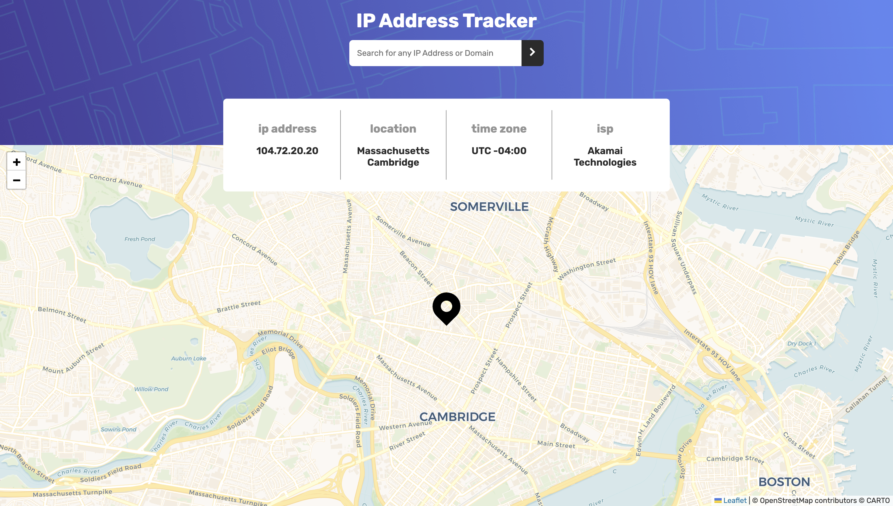
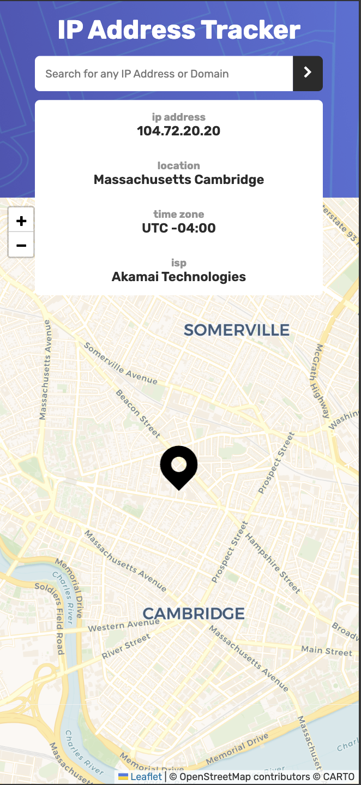

# IP Address Tracker

A responsive IP address tracker built with React and TypeScript.

This project is a solution to the IP Address Tracker challenge on Frontend Mentor.

## Overview

Users can:

- View their own IP address and location on initial load
- Search for an IP address
- Search for a domain
- View the location on an interactive map
- See a loading indicator while data is being fetched
- See an error message when a request fails
- Use the application on both desktop and mobile devices




## Built with

- React
- TypeScript
- Vite
- React Leaflet
- Leaflet
- IPify Geolocation API
- CARTO map tiles
- CSS

## What I learned

Through this project, I practiced:

- Fetching data from an external API
- Handling different API query parameters for IP addresses and domains
- Managing loading, error, and fetched data states in React
- Using TypeScript interfaces for API data and component props
- Updating a Leaflet map when coordinates change
- Creating responsive layouts with Flexbox and CSS Grid

## Running the project locally

Install the dependencies:

```bash
npm install
```
